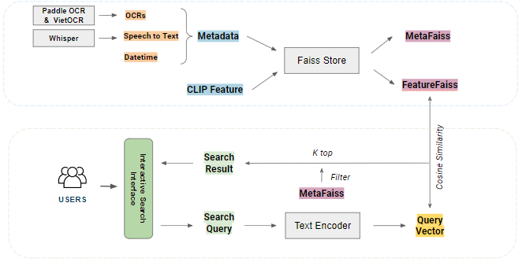
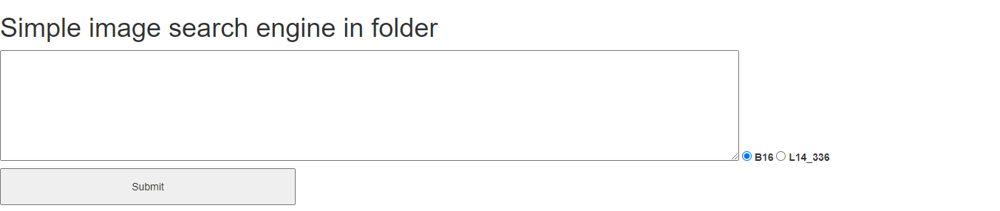

# AIC2022-SIUAILab-PumpkinSoup 

This is our approach for solving the Event Retrieval from Visual Data problems at AIC 2022 in Hochiminh, Vietnam. 
The problem is to search a video based on a text discriptions(Textual KIS) or an excerpt of the video (Video KIS). 


## Approach



## Datasets: 
Datasets are divided into 3 packs 0, 1 and 2. In each pack, it includes: 
- CLIPFeature: Feature etracted by CLIP model corresponding to Keyframe in a certain Video. 
- Keyframe: Keyframes in a Video. 
- Object: Objects in each Keyframe. 
- Metadata: Other information of a Video. 
- Video: Video. 

## Usage

First, please visit [CLIP Github](https://github.com/openai/CLIP) and set everything up according to their descriptions. In the respository, CLIP folder is located at /source/src/CLIP. 
(Using for searching image by text query.)

Second, please visit [Pylucene](https://github.com/coady/lupyne), then pull docker image as they suggested. 
In the respository, Pylucene is put at /source/libs/pylucene. 
(Using for text indexing.)

Third, please visit [Faiss](https://github.com/facebookresearch/faiss) and install faiss library. It should be installed in CLIP enviroment. 
(Using for vector indexing.)

Last but not least, pleasr run this command to put everything together. 
```bash
cd /source
pip install requirements.txt  
```
## API

Our system provides the following methods:

#### `text_search_api.py`

Returns the list of keyframe that is the most closed to a certain text query. 

#### `text_search_2_api.py`

Returns the list of keyframe that is the most closed to a certain text query. In addition, you could enter the second text for searching in limited area which is found by the first text query. 

#### `image_search_api.py`

Returns the list of keyframe that is the most closed to an image which might be on the Internet or local location. Image URL will be the input for the method. 

#### `counting_object_api.py`

Returns the list of keyframe that is the most closed to text which contains objects and theirs quantity in an image (keyframe). For example: "3 human 2 tree 1 toy". 

#### `whisper_api.py`

Returns the list of keyframe that is the most closed to text which is assumed to belong to what is said in the video. For more details, please navigate to  source/src/whisper. 

## More Examples

### Searching based on one text query only: 
Firstly, please run `text_search_api.py` file at /source/api to start the API. You can change the port at main function in the file. Notice, the methods should be run in CLIP enviroment. 

Next, to use an effective interface, please start a website by running file server.py at /source/web_v1/text_query/server.py. Note, you can change the port that the main function in the file. 

Then you can visit the website, it will something look like below:

### Searching based on more than one methods: 
Firstly, please run all files at /source/api excepting `text_search_api.py` to start the APIs. Note, you can change the port at main function in the file. 
    - Before running `counting_object_api.py`, please navigate into /source/utils/countingObjects, then run file indexing.py. Notice that those methods should be run in Pylucene enviroment. 
    - `text_search_2_api.py` and `image_search_api.py` should be run in CLIP enviroment, don't forget that `faiss` library shoubld be installed. 
    - `whisper_api.py` should be run in whisper enviroment obviously. 

Next, to use an effective interface, please start a website by running file server.py at /source/web_v2/text_query/server.py. Note, you can change the port that the main function in the file. 

Then you can visit the website, it will something look like below:


